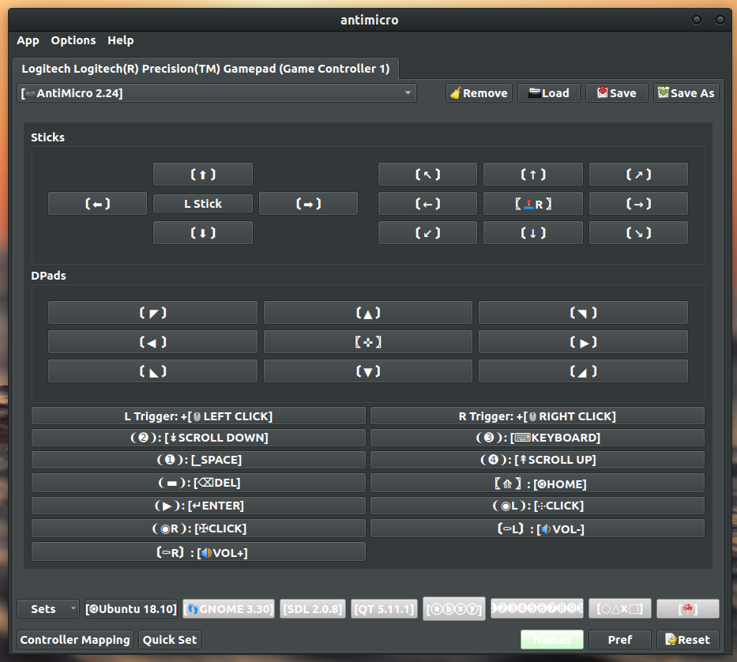
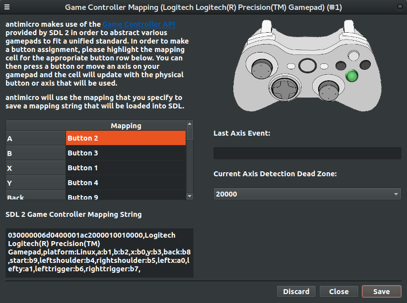
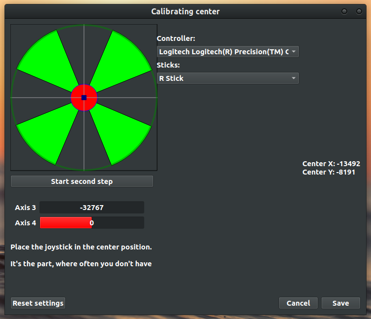
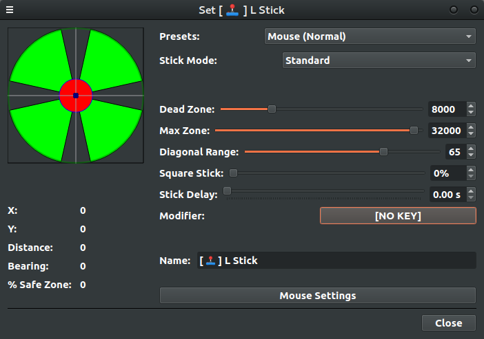

#  AntiMicroX 3.0.1 

# The program is abandoned today. More and more responsibilities and opportunities are coming and I don't have time to run this program as much as I should. If you want to develop this program, don't forget to keep the previous developers in the files as it is.

## this program is not a part of the official AntiMicro, just like I never was. I cannot help with problems with version 2.23 and below


1. [Description](#description)  
2. [License](#license)  
3. [Command Line](#command-line) 
4. [Wiki](#wiki)
5. [Build Dependencies](#build-dependencies)  
    a. [Building Under Linux](#building-under-linux)  
    b. [Building deb package](#building-deb-package)  
    c. [Running With Docker](#running-with-docker)  
    d. [Building AppImage](#building-appimage)  
6. [Testing Under Linux](#testing-under-linux)  
7. [AntiMicroX Profiles](#antimicrox-profiles)
8. [Support](#support)  
9. [Bugs](#bugs)  
10. [Shoutout](#shoutout)  
11. [Credits](#credits)  
12. [Participation in the translation of AntiMicroX](#participation-in-the-translation-of-antimicrox)

<br/>

## Description

antimicroX is a graphical program used to map keyboard keys and mouse controls
to a gamepad. This program is useful for playing PC games using a gamepad that
do not have any form of built-in gamepad support. However, you can use this 
program to control any desktop application with a gamepad; on Linux, this
means that your system has to be running an X environment in order to run
this program.

This program is currently supported under various Linux
distributions.

Informations about all developers from AntiMicro team and main creator (Ryochan7) are included in 
application. Their **old versions** are here:

https://github.com/AntiMicro/antimicro  
https://github.com/Ryochan7/antimicro  

**Screenshots:**
<table border="0px" >
<tr><td>


  </td><td>
    
  </td></tr>

  <tr><td>
    

  </td><td>
    
  </td></tr>
</table>
<br/>


## License

This program is licensed under the GPL v.3. Please read the LICENSE text document
included with the source code if you would like to read the terms of the license.
The license can also be found online at
http://www.gnu.org/licenses/gpl.txt

<br/>

## Command Line

    Usage: antimicroX [options] [profile]

    Options:
    -h, --help                     Print help text.
    -v, --version                  Print version information.
    --tray                         Launch program in system tray only.
    --no-tray                      Launch program with the tray menu disabled.
    --hidden                       Launch program without the main window
                                   displayed.
    --profile <location>           Launch program with the configuration file
                                   selected as the default for selected
                                   controllers. Defaults to all controllers.
    --profile-controller <value>   Apply configuration file to a specific
                                   controller. Value can be a
                                   controller index, name, or GUID.
    --unload [<value>]             Unload currently enabled profile(s).
                                   Value can be a controller index, name, or GUID.
    --startSet <number> [<value>]  Start joysticks on a specific set.
                                   Value can be a controller index, name, or GUID.
    -d, --daemon                   Launch program as a daemon. Use only on Linux.
    --log-level (debug|info)       Enable logging. Default: debug.
    --log-file <filename>          Choose a file for writing logs
    --eventgen (xtest|uinput)      Choose between using XTest support and uinput
                                   support for event generation. Use only if you have
                                   enabled xtest and uinput options on Linux. Default: xtest.
    -l, --list                     Print information about joysticks detected by
                                   SDL. Use only if you have sdl library. You can 
                                   check your controller index, name or 
                                   even GUID.  

<br/>

## Wiki

[Look here](https://github.com/juliagoda/antimicroX/wiki)

<br/>

## Build Dependencies

This program is written in C++ using the [Qt](https://www.qt.io/)
framework. A C++ compiler and a proper C++ build environment will need to be
installed on your system prior to building this program. Under Debian and
Debian-based distributions like Ubuntu, the
easiest way to get a base build environment set up is to install the
meta-package **build-essential**. The following packages are required to be
installed on your system in order to build this program:

* g++
* cmake
* extra-cmake-modules
* qttools5-dev and qttools5-dev-tools (qt5-tools on distros based on Arch Linux) (Qt5 support)
* libsdl2-dev (sdl2 on distros based on Arch Linux) (SDL2)
* libxi-dev (libxi on distros based on Arch Linux) (Optional. Needed to compile with X11 and uinput support)
* libxtst-dev (libxtst on distros based on Arch Linux) (Optional. Needed to compile with XTest support)
* libx11-dev (libx11 on distros based on Arch Linux) (Needed to compile with Qt5 support)
* itstool (extracts messages from XML files and outputs PO template files, then merges translations from MO files to create translated XML files)
* gettext
* libqt5x11extras5-dev

<br/>

### Building Under Linux

In order to build this program, open a terminal and cd into the antimicroX
directory. Enter the following commands in order to build the program:

    cd antimicroX
    mkdir build && cd build
    cmake ..
    make
    sudo make install
    
or

```
cd antimicrox
mkdir build && cd build
cmake --build .
sudo cmake --install .
```
<br/>

### Arch Linux or Arch Linux based distributions:

```
git clone https://github.com/archlinux-lucjan/archlinux-packages.git
cd antimicrox-git
makepkg -sric
```

or

```
trizen -S antimicrox-git
```

<br/>

### Fedora

```
dnf install antimicroX
```

<br/>

### Distribution packages

 **Distro** | **Maintainer** | **Package**  |
| :--------- | :------------- | :----------- |
| Arch Linux | Piotr Górski   | [antimicrox-git](https://aur.archlinux.org/packages/antimicrox-git) <sup>AUR</sup> |
| Fedora Linux | [Gergely Gombos](https://github.com/gombosg) | antimicroX |

<br/>

### Building deb package
Already built .deb files are available on [Release Page](https://github.com/juliagoda/antimicroX/releases)

```
    cd antimicroX
    mkdir build && cd build
    cmake ..
    cpack
```


<br/>

### Running with Docker

If you want to run application without building process and choose between various distributions, then [look here](https://hub.docker.com/r/juliagoda/antimicrox)  

<br/>

All full tags variations:

- juliagoda/antimicrox:latest

- juliagoda/antimicrox:3.0-ubuntu-bionic

- juliagoda/antimicrox:3.0-fedora-latest

- juliagoda/antimicrox:3.0-suseleap15.2

<br/>

Because the docker likes to replace the README on the docker hub website with this one. I need to add informations about how to run image:  

You should as first:

`git pull juliagoda/antimicrox:3.0-ubuntu-bionic`

where "3.0-ubuntu-bionic" is a tag and can be replaced by other chosen tag. Next we have to create group docker and add user to it. [Look here](https://docs.docker.com/engine/install/linux-postinstall/). To run GUI docker apps:

`xhost +local:docker`

To finally run image:

`docker run -it -e DISPLAY=unix$DISPLAY --mount type=bind,source=/dev/input,target=/dev/input --device /dev/input --mount type=bind,source=/home/$USER,target=/home/$USER --net=host -e HOME=$HOME --volume="/tmp/.X11-unix:/tmp/.X11-unix:rw" --device /dev/dri:/dev/dri --workdir=$HOME antimicrox:3.0-ubuntu-bionic`

This allows the use your files from your home directory and the use of your connected devices without other workarounds

<br/>

### Building AppImage

<br/>

Create build directory
```bash
mkdir build && cd ./build
```

<br/>

Download tools used for creating appimages (and make them executable)
```bash  
wget https://github.com/linuxdeploy/linuxdeploy/releases/downloacontinuous/linuxdeploy-x86_64.AppImage
wget https://github.com/AppImage/AppImageKit/releases/downloacontinuous/appimagetool-x86_64.AppImage
wget https://github.com/linuxdeploy/linuxdeploy-plugin-qt/releasedownload/continuous/linuxdeploy-plugin-qt-x86_64.AppImage
chmod +x linuxdeploy-x86_64.AppImage
chmod +x appimagetool-x86_64.AppImage
chmod +x linuxdeploy-plugin-qt-x86_64.AppImage
```

<br/>

Build antimicroX and install it in AppDir directory
```bash
cmake .. -DCMAKE_INSTALL_PREFIX=/usr
make
make install DESTDIR=AppDir
```

<br/>

Create AppImage file
```bash
./linuxdeploy-x86_64.AppImage --appdir AppDir --plugin qt
./appimagetool-x86_64.AppImage AppDir/ --no-appstream
```
<br/>

## Testing Under Linux

If you are having problems with antimicroX detecting a controller or
detecting all axes and buttons, you should test the controller outside of
antimicroX to check if the problem is with antimicroX or not. The two endorsed
programs for testing gamepads outside of antimicroX are **sdl-jstest**
(**sdl2-jstest**) and **evtest**. SDL2 utilizes evdev on Linux so performing
testing with older programs that use joydev won't be as helpful since some
devices behave a bit differently between the two systems. Another method also exist, 
which can be found [here](https://github.com/juliagoda/SDL_JoystickButtonNames).

<br/>

## AntiMicroX Profiles

If you would like to send the profile you are using for your application or find something 
for yourself, [here](https://github.com/juliagoda/antimicroX-profiles) is the forked repository. If you want to report a bug, ask 
a question or share a suggestion, you can do that on the antimicroX page or on the
[antimicroX-profiles](https://github.com/juliagoda/antimicroX-profiles) page.

<br/>

## Support

In order to obtain support, you can post an issue [here](https://github.com/juliagoda/antimicroX/issues) .

<br/>

## Bugs

Application's bugs will be fixed. There are created tests for detecting bugs. Of course, I'm open to proposals or questions from users. 

<br/>

## Shoutout

A big, original inspiration for this program was the program QJoyPad.

<br/>

## Credits

<br/>

### Contributors

juliagoda

<br/>

### Original Developer

Travis Nickles <nickles.travis@gmail.com>

<br/>

### Old Contributors

Zerro Alvein  
aybe  
Jeff Backus <jeff@jsbackus.com>  
Arthur Moore  
Anton Tornqvist <antont@inbox.lv>
mtdeguzis

<br/>

### Translators

VaGNaroK <vagnarokalkimist@gmail.com> - Brazilian Portuguese  
zzpxyx - Chinese  
Belleguic Terence <hizo@free.fr> - French  
Leonard Koenig <leonard.r.koenig@googlemail.com> - German  
phob - German  
tou omiya - Japanese  
Dmitriy Koshel <form.eater@gmail.com> - Russian  
Jay Alexander Fleming <tito.nehru.naser@gmail.com> - Serbian  
burunduk - Ukrainian  
Flavio HR <flavio.hrx@gmail.com> - Spanish  
WAZAAAAA - <wazaaaaa00@gmail.com> - Italian  
juliagoda <juliagoda.pl@protonmail.com> - Polish

<br/>

## Participation in the translation of AntiMicroX

If you want to participate in the translation of the program, but your language is not yet on the support list. Please contact us.

However, if your language is already supported in the program, you must have the Qt Linguist program installed, which is usually included in the qt5-tools package, to conveniently translate the application. However, before you do that, make sure that you don't already have this program installed. All you have to do is open it, and then use it to open a file with the ts extension.

If a red exclamation mark appears in the translation field, it means that your translation does not end with the same sign as the original content. Try to place commas or dots in appropriate places and often save your progress.

