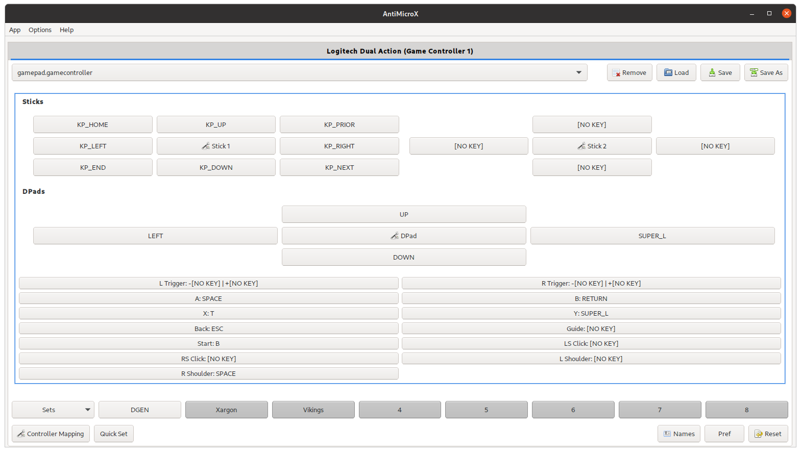
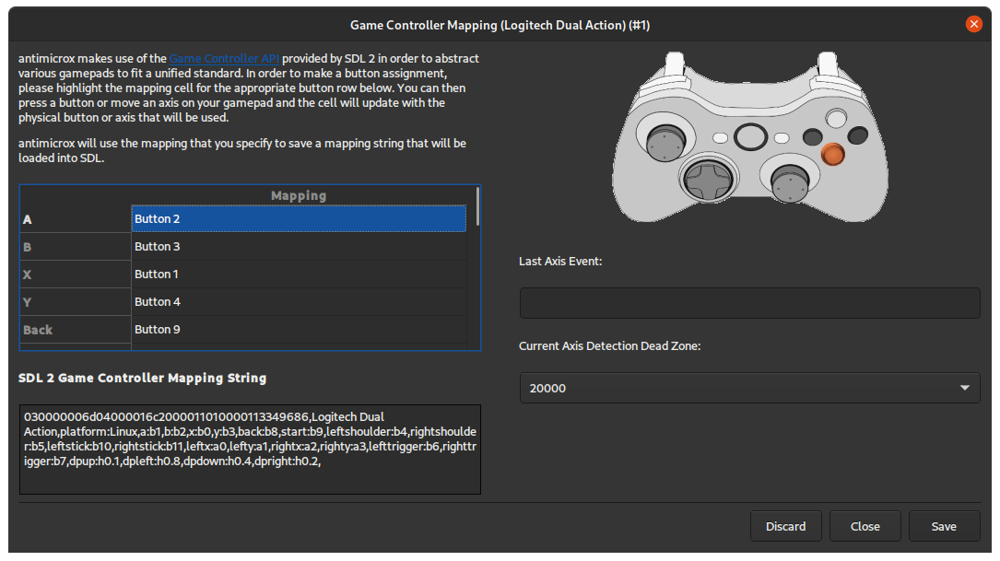
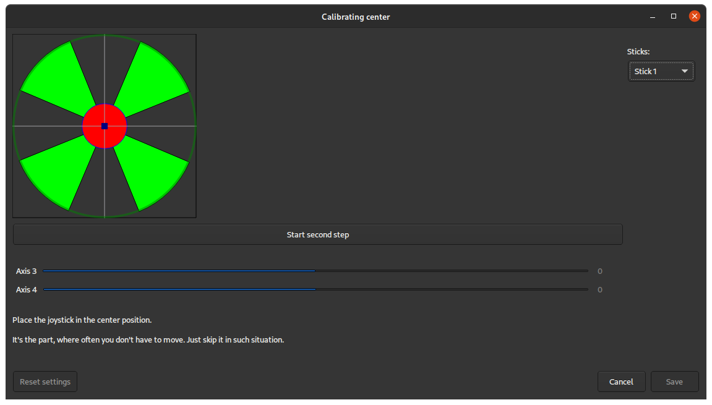
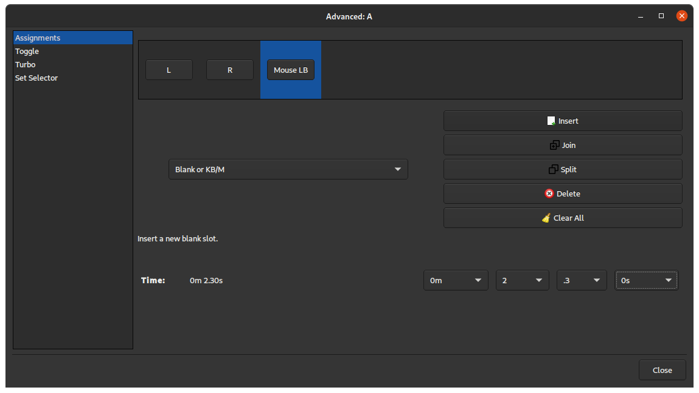

#  AntiMicroX

1. [Description](#description)  
2. [License](#license)  
3. [Installation](#installation)
4. [Wiki](#wiki)
5. [Command Line](#command-line) 
6. [Testing Under Linux](#testing-under-linux)  
7. [AntiMicroX Profiles](#antimicrox-profiles)
8. [Support](#support)  

## Description

AntiMicroX is a graphical program used to map gamepad keys to keyboard, mouse, scripts and macros. You can use this program to control any desktop application with a gamepad on Linux🐧 and Windows 🪟.  
It can be also used for generating SDL2 configuration (useful for mapping atypical gamepads to generic ones like xbox360).

We support X.org and Wayland.

Features:

- Mapping of gamepads/joystick buttons to:
  - keyboard buttons
  - mouse buttons and moves
  - scripts and executables
  - macros consisting of elements mentioned above
- Assigning multiple switchable sets of mappings to gamepad.
- Auto profiles - assign profile to active application window (not in Wayland [note](https://github.com/AntiMicroX/antimicrox/issues/303)).

This program is currently supported under various Linux
distributions.

This application is continuation of project called `AntiMicro`, which was later abandoned and revived by juliagoda.

Legacy repositories:
- First AntiMicroX repository: https://github.com/juliagoda/antimicroX
- Second, maintained by organization: https://github.com/AntiMicro/antimicro
- First, original AntiMicro repository: https://github.com/Ryochan7/antimicro

**Screenshots:**  
Disclaimer: Theme may depend on your system configuration.

<table border="0px" >
  <tr>
    <td>
      
    </td>
    <td>
      
    </td>
  </tr>
  <tr>
    <td>
      
    </td>
    <td>
    
    </td>
  </tr>
</table>

## License

This program is licensed under the GPL v.3. Please read the LICENSE text document
included with the source code if you would like to read the terms of the license.
The license can also be found online at
http://www.gnu.org/licenses/gpl.txt

## Installation

### Windows

Just download `antimicrox-X.X.X-AMD64.exe` from [Release site](https://github.com/AntiMicroX/antimicrox/releases/latest) and install it.

### Flatpak

The flatpak version is distributed on Flathub, and runs on most major Linux distributions. See instructions here: [Flathub application page](https://flathub.org/apps/details/io.github.antimicrox.antimicrox)

If you have Flathub [set up](https://flatpak.org/setup/) already:

```bash
flatpak install flathub io.github.antimicrox.antimicrox
```

❕ Flatpak package may not work correctly with wayland [(Fix available here)](https://github.com/AntiMicroX/antimicrox/wiki/Open-uinput-error)

### AppImage

Download from the [release site](https://github.com/AntiMicroX/antimicrox/releases).

It is recommended to use [AppImageLauncher](https://github.com/TheAssassin/AppImageLauncher) with this package.

### Debian/Ubuntu-based distributions

Download from the [release site](https://github.com/AntiMicroX/antimicrox/releases) and install `.deb` package.

### Fedora

```
dnf install antimicrox
```

### openSUSE

A [package](https://software.opensuse.org/package/antimicrox) is available.

```
zypper install antimicrox
```

### Arch Linux or Arch Linux based distributions:

```
trizen -S antimicrox
```
**or**

pre-built version can de downloaded from unofficial repository called [chaotic-aur](https://lonewolf.pedrohlc.com/chaotic-aur/).

Append (one of listed mirrors) to `/etc/pacman.conf`:
```bash
# Brazil
Server = http://lonewolf-builder.duckdns.org/$repo/$arch
# Germany
Server = http://chaotic.bangl.de/$repo/$arch
# USA (Cloudflare cached)
Server = https://repo.kitsuna.net/$arch
# Netherlands
Server = https://chaotic.tn.dedyn.io/$arch
```
To check signature, add keys:
```bash
sudo pacman-key --keyserver hkp://keyserver.ubuntu.com -r 3056513887B78AEB 8A9E14A07010F7E3
sudo pacman-key --lsign-key 3056513887B78AEB
sudo pacman-key --lsign-key 8A9E14A07010F7E3
```
Install package
```bash
pacman -S antimicrox
```

### Building Yourself

List of required dependencies and build instructions can be found [here](./BUILDING.md).

### Packages status

Status of package `antimicrox`:  
[](https://repology.org/project/antimicrox/versions)

## Command Line

Run `antimicrox --help` or read `man antimicrox` for command-line parameters.

<details>
  <summary>Commandline for flatpak</summary>
  In case of flatpak package AntiMicroX can be launched with command:
  <br>
  <code>flatpak run io.github.antimicrox.antimicrox</code> instead of just <code>antimicrox</code>
  <br>
  In some cases it may be good to add alias
  <br>
  <code>alias antimicrox='flatpak run io.github.antimicrox.antimicrox'</code><br>
  fo file <code>~/.bashrc</code>
</details>

## Wiki

[Look here](https://github.com/AntiMicroX/antimicrox/wiki)

## Testing Under Linux

If you are having problems with antimicrox detecting a controller or
detecting all axes and buttons, you should test the controller outside of
antimicrox to check if the problem is with antimicrox or not. The two endorsed
programs for testing gamepads outside of antimicrox are **sdl-jstest**
(**sdl2-jstest**) and **evtest**. SDL2 utilizes evdev on Linux so performing
testing with older programs that use joydev won't be as helpful since some
devices behave a bit differently between the two systems. Another method also exists, 
which can be found [here](https://github.com/juliagoda/SDL_JoystickButtonNames).

## AntiMicroX Profiles

If you would like to send the profile you are using for your application or find something 
for yourself, [here](https://github.com/AntiMicroX/antimicrox-profiles) is the forked repository. If you want to report a bug, ask 
a question or share a suggestion, you can do that on the antimicrox page or on the
[antimicrox-profiles](https://github.com/AntiMicroX/antimicrox-profiles) page.

## Support

There are several ways to get help with AntiMicroX. The easiest way is to upvote (with 👍) issues you thing are the most important ones. It is also possible to fund some issues using [Polar](https://polar.sh) platform to attract contributors.

### Contributing

Any contributions into codebase are welcome. You can find contribution guide [here](./CONTRIBUTING.md).  
Some issues are may have bounties which are meant to attract contributors.

### Translation

Translation process is handled via [Weblate](https://weblate.org/). If you want to help just click this [link](https://hosted.weblate.org/engage/antimicrox).

Translation status

<a href="https://hosted.weblate.org/engage/antimicrox/">

</a>

More information about translating can be found [here](https://github.com/AntiMicroX/antimicrox/wiki/Translating-AntiMicroX).
